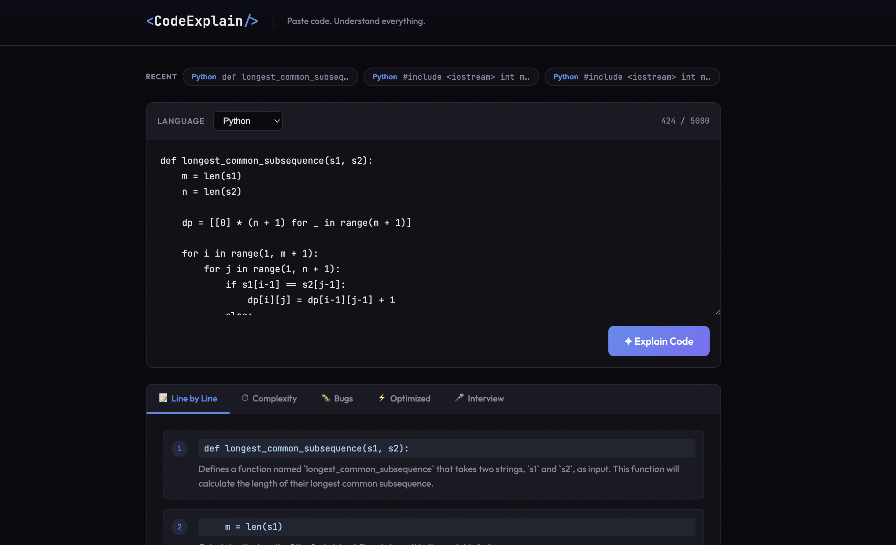
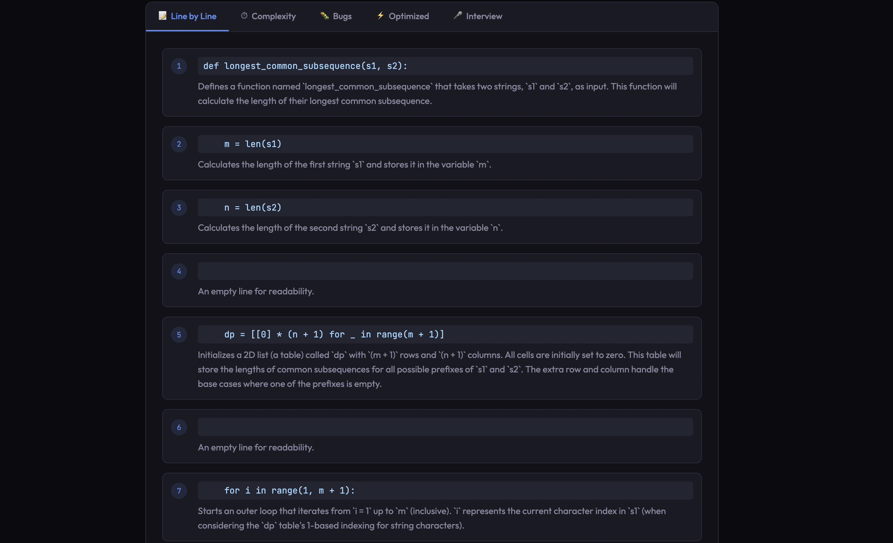
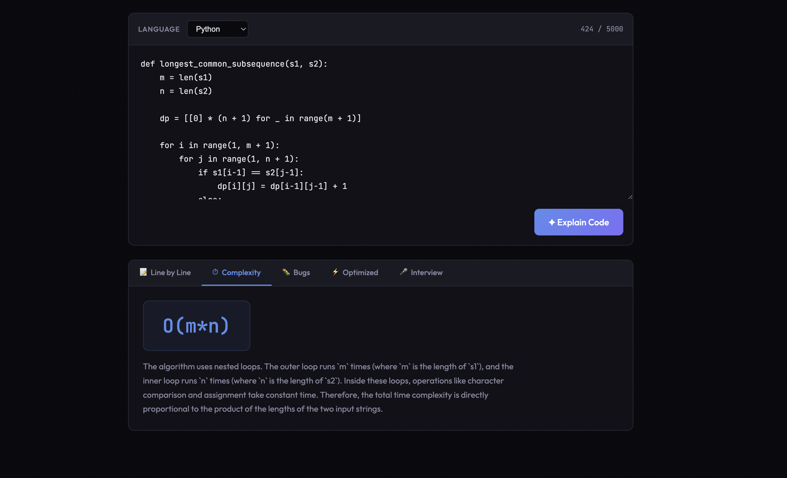
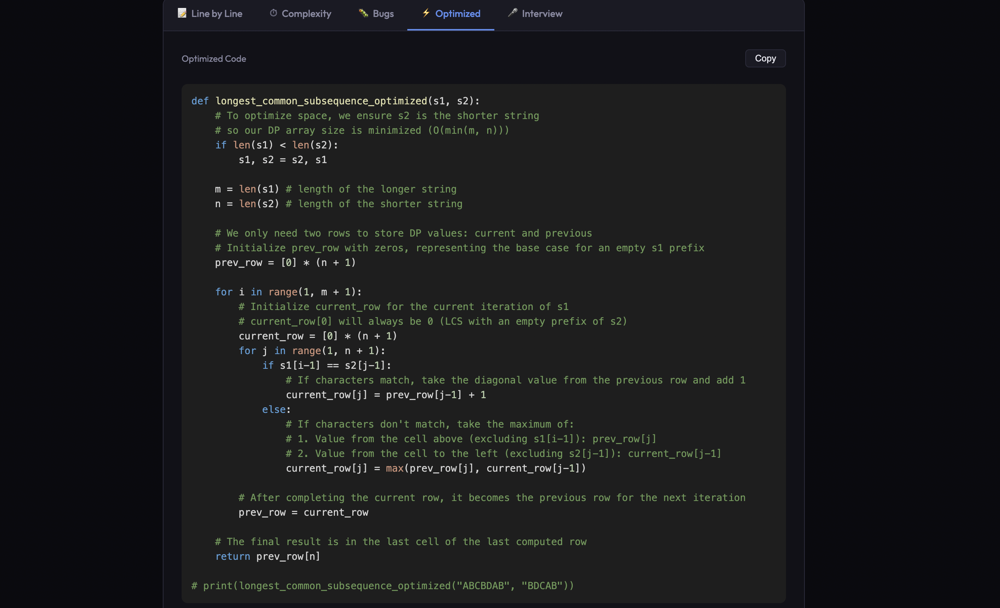
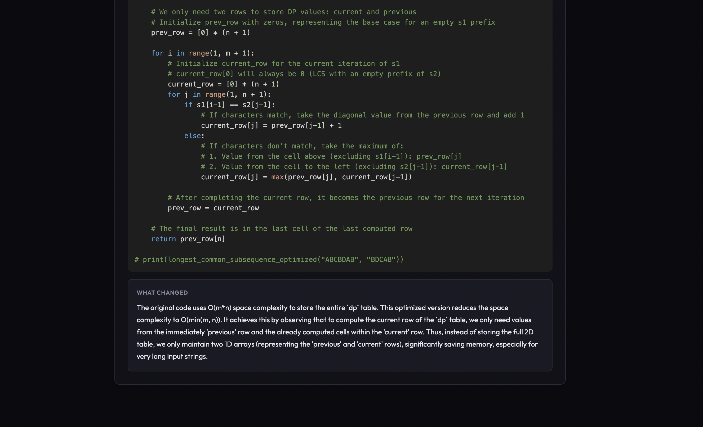
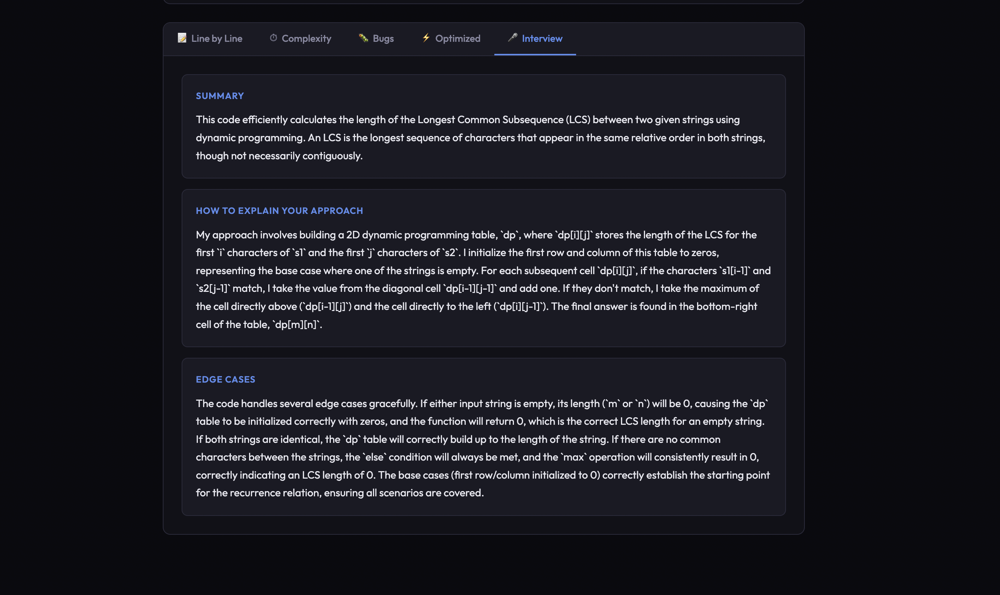
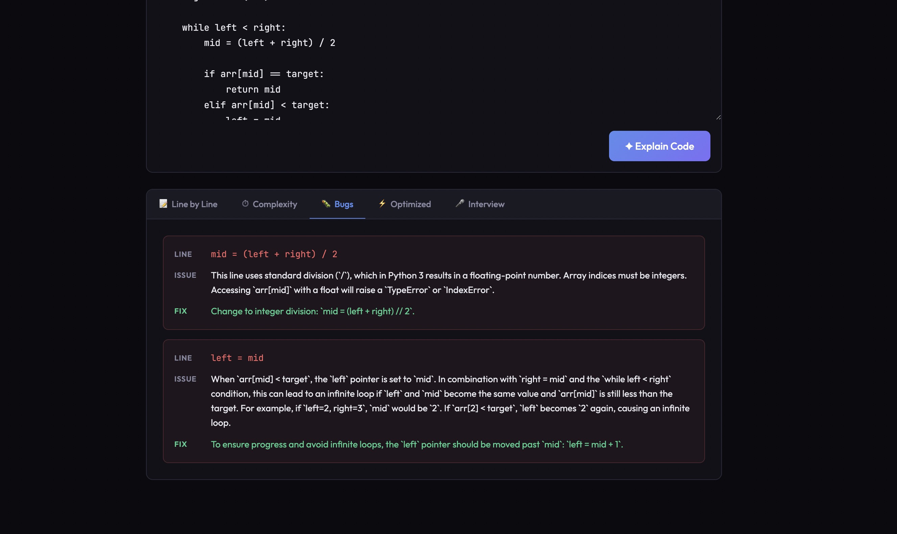

# AI Code Explainer

I built this in a week to actually understand what goes into shipping a real AI project — not just calling an API, but designing prompts, handling errors, connecting a frontend to a backend, and deploying both.

**Try it here:** [project-5rp1c.vercel.app](https://project-5rp1c.vercel.app)

---

## What it does

Paste any code snippet, pick the language, and click explain. You get back five things:

- **Line by line** — what each line actually does, in plain English
- **Time complexity** — Big-O with a real explanation of why
- **Bugs** — anything that could go wrong, and how to fix it
- **Optimized version** — a cleaner rewrite with syntax highlighting and a copy button
- **Interview explanation** — how you'd talk through this code if someone asked you in an interview, including edge cases

It works with Python, JavaScript, TypeScript, Java, C++, C, Go, Rust, PHP, and Ruby. Your last 3 explanations are saved locally so you can go back to them without re-running everything.

## Screenshots







## How I built it

The backend is a FastAPI server in Python. When you submit code, it builds a prompt that tells Gemini to return a specific JSON structure with all five sections. I spent most of Day 2 just getting this prompt right — making sure all five sections always came back even for broken or one-line code snippets, and that the JSON was clean enough to parse reliably.

The frontend is React with Vite. Five tabs, a loading spinner, a copy button that shows a toast notification, and a history bar at the top. Nothing fancy — just stuff that makes it actually pleasant to use.

The one thing that surprised me was debugging CORS after deploying. The frontend is on Vercel and the backend is on Render, which are two different domains. The browser blocks cross-origin requests by default, so I had to configure the backend to explicitly allow the Vercel URL. Sounds simple, but took a while to figure out in production.

## Stack

- React + Vite (frontend)
- FastAPI + Python (backend)
- Google Gemini API — gemini-2.5-flash
- react-syntax-highlighter for the code display
- Vercel for the frontend, Render for the backend

## Run it locally

You'll need a free Gemini API key from aistudio.google.com — no credit card required.

**Backend:**
```bash
cd backend
python -m venv venv
source venv/bin/activate
pip install -r requirements.txt
cp .env.example .env
# paste your Gemini API key into .env
uvicorn main:app --reload
```

**Frontend:**
```bash
cd frontend
npm install
npm run dev
```

Open http://localhost:5173.

## Folder structure

```
ai-code-explainer/
├── backend/
│   ├── main.py          # FastAPI server, Gemini call, prompt
│   ├── requirements.txt
│   ├── Procfile         # tells Render how to start the server
│   └── .env.example
├── frontend/
│   ├── src/
│   │   ├── App.jsx
│   │   └── App.css
│   └── package.json
└── README.md
```

## What I'd add next

- File upload so you don't have to paste code manually
- Shareable links for each explanation
- Support for explaining entire functions or classes rather than just snippets
- Maybe a VS Code extension version eventually